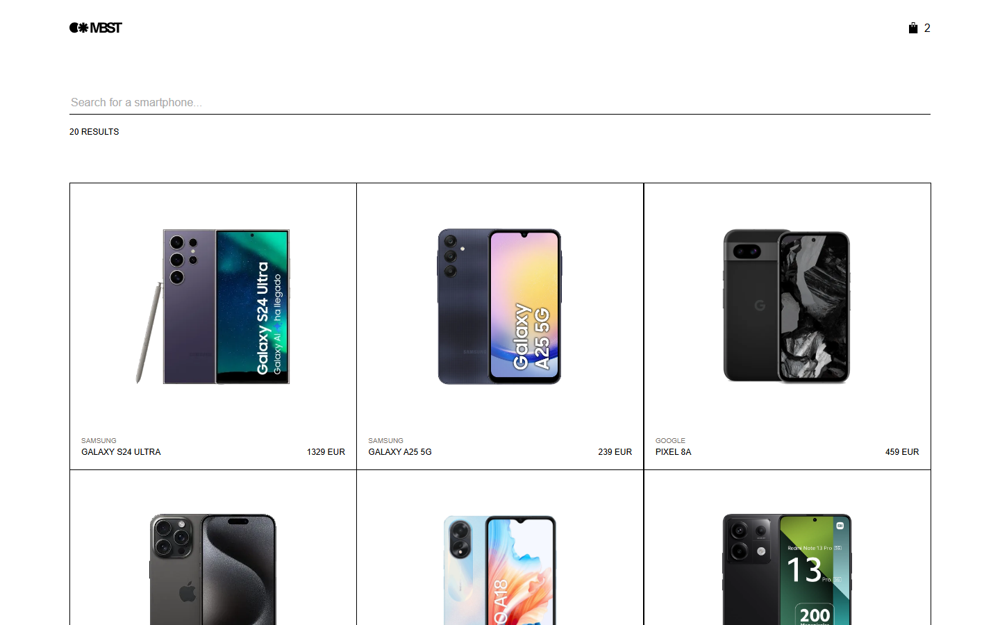
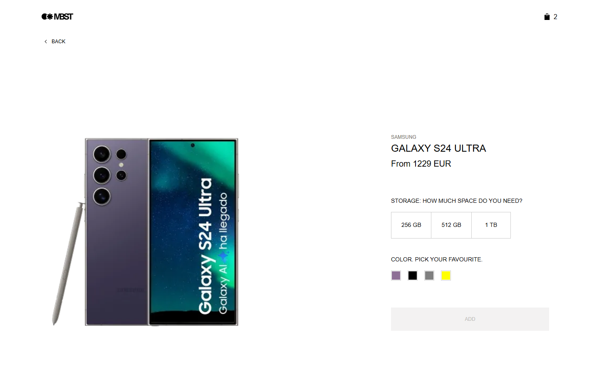
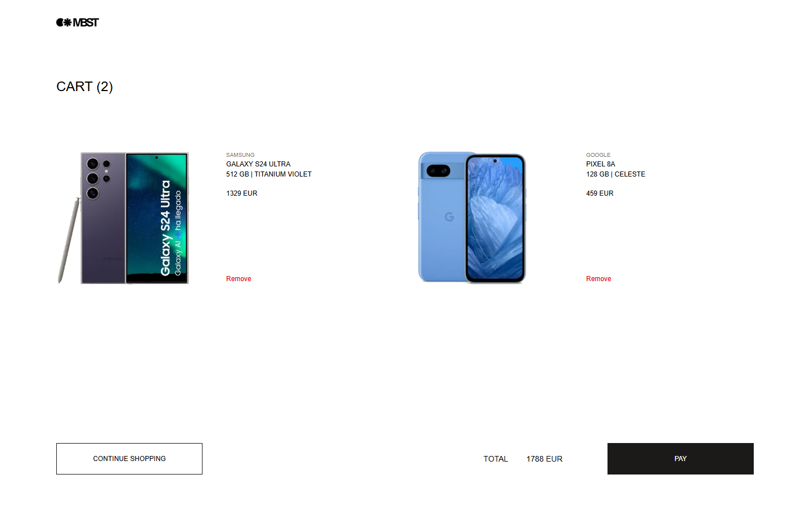
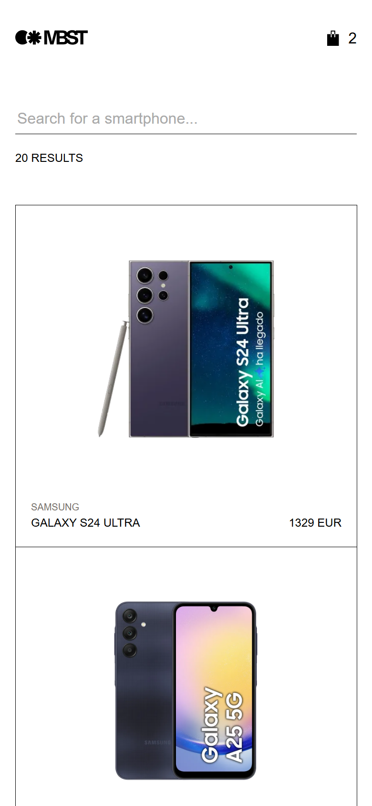
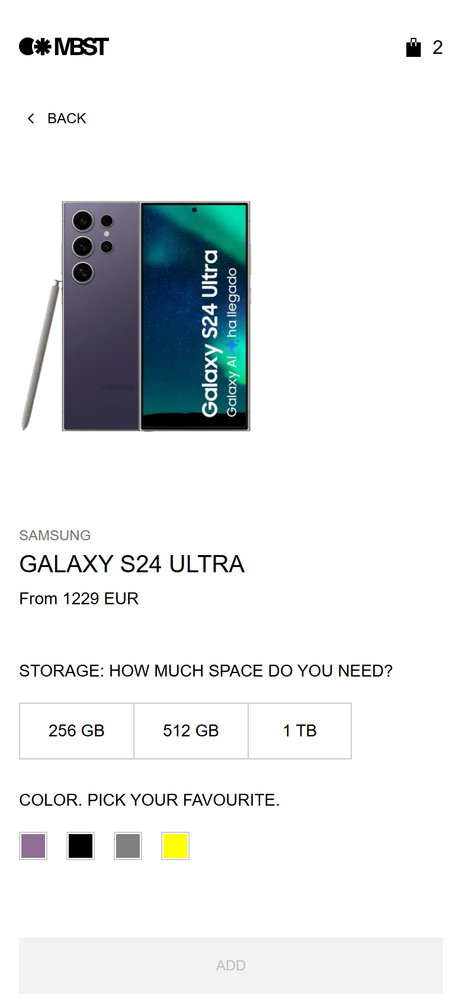
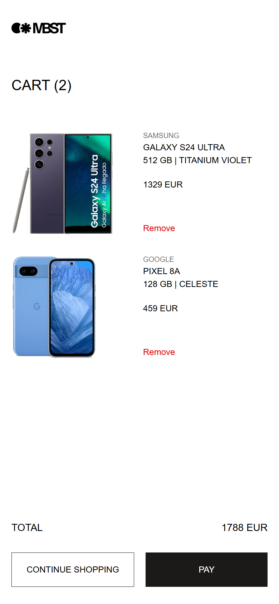

# MBST · Zara Challenge (Smartphones)

A web app to browse, search and buy smartphones: a product list with real-time search, a detail view to choose storage and colour, and a persistent cart. Built with React, TypeScript and Vite, following the Figma designs for mobile, tablet and desktop.

<!-- TODO: add the live demo URL once deployed -->

## Contents

- [MBST · Zara Challenge (Smartphones)](#mbst--zara-challenge-smartphones)
  - [Contents](#contents)
  - [Screenshots](#screenshots)
  - [Features](#features)
  - [Getting started](#getting-started)
    - [Requirements](#requirements)
    - [Installation](#installation)
    - [Development and production modes](#development-and-production-modes)
    - [Scripts](#scripts)
  - [Tech stack](#tech-stack)
  - [Architecture](#architecture)
    - [Folder structure](#folder-structure)
    - [Data flow](#data-flow)
    - [State](#state)
    - [Routing](#routing)
    - [Styles](#styles)
  - [API data issues and how they are handled](#api-data-issues-and-how-they-are-handled)
  - [Design decisions](#design-decisions)
  - [Accessibility](#accessibility)
  - [Testing](#testing)
  - [Code quality](#code-quality)
  - [Known limitations and next steps](#known-limitations-and-next-steps)

---

## Screenshots

**Desktop**



| Product detail                                                    | Cart                                                  |
| ----------------------------------------------------------------- | ----------------------------------------------------- |
|  |  |

**Mobile**

| Product list                                                | Product detail                                                  | Cart                                                |
| ----------------------------------------------------------- | --------------------------------------------------------------- | --------------------------------------------------- |
|  |  |  |

---

## Features

**Product list (`/`)**

- Grid with the first 20 phones from the API: image, brand, name and base price.
- Real-time search by name or brand, filtered by the API. It waits 300 ms after the last key and cancels the requests that are no longer needed.
- Number of results below the search box, announced to screen readers.
- The search is kept in the URL (`/?search=galaxy`), so it can be shared and survives going back from a product.

**Product detail (`/product/:id`)**

- Brand, name, and a large image that changes with the selected colour.
- Storage and colour selectors, with the price updated in real time: "From {cheapest price}" until a storage is chosen, then the price of that storage is applied.
- The "Add" button is only enabled once storage and colour are chosen. If a product has a single option, it is selected for the user.
- Specifications table.
- "Similar items" carousel: scroll snapping, drag to scroll with the mouse, and a custom scrollbar.

**Cart (`/cart`)**

- Each line shows the image, name, chosen storage and colour, and its price, with a button to remove it.
- Total price and "Continue shopping" back to the list.
- Persistent: the cart is saved in `localStorage` and survives reloads.

**Everywhere**

- Navbar with a link to the home page and a cart icon that shows how many phones are in the cart.
- Not found page for unknown URLs, plus loading and error states.
- Scroll restoration: a new page starts at the top, and going back returns to where you were.

---

## Getting started

### Requirements

- **Node.js 18.18 or later.** The project is developed and tested on Node 18.20.8 (see `.nvmrc`).
- npm

### Installation

```bash
git clone https://github.com/sergiram/zara-challenge.git
cd zara-challenge
npm install
```

Copy `.env.example` to `.env.local`. It contains the two variables the app needs:

| Variable            | Description                                                                               |
| ------------------- | ----------------------------------------------------------------------------------------- |
| `VITE_API_BASE_URL` | Base URL of the REST API                                                                  |
| `VITE_API_KEY`      | Key sent in the `x-api-key` header of every request (provided in the challenge statement) |

### Development and production modes

| Mode               | Command           | What it does                                                                             |
| ------------------ | ----------------- | ---------------------------------------------------------------------------------------- |
| Development        | `npm run dev`     | Serves the source modules unminified, with hot reload, at http://localhost:5173          |
| Production         | `npm run build`   | Type-checks the project, then bundles, concatenates and minifies the assets into `dist/` |
| Production preview | `npm run preview` | Serves the `dist/` build locally at http://localhost:4173                                |

### Scripts

| Script                            | Description                                |
| --------------------------------- | ------------------------------------------ |
| `npm run dev`                     | Development server                         |
| `npm run build`                   | Type check (`tsc -b`) and production build |
| `npm run preview`                 | Serves the production build                |
| `npm test`                        | Tests in watch mode                        |
| `npm run test:run`                | Tests, single run                          |
| `npm run test:coverage`           | Tests with a coverage report               |
| `npm run lint` / `lint:fix`       | ESLint                                     |
| `npm run format` / `format:check` | Prettier                                   |
| `npm run typecheck`               | TypeScript, without building               |

---

## Tech stack

| Area       | Choice                                                           |
| ---------- | ---------------------------------------------------------------- |
| UI         | React 19 + TypeScript (strict)                                   |
| Build tool | Vite 6                                                           |
| Routing    | React Router 6                                                   |
| State      | React Context API + `useReducer` for the cart                    |
| Styles     | SCSS Modules and CSS custom properties                           |
| Testing    | Vitest, React Testing Library, user-event, jest-dom and axe-core |
| Quality    | ESLint 9 (typescript-eslint, react-hooks, jsx-a11y) and Prettier |

**Why these versions:** the challenge requires Node 18. The latest majors of Vite, React Router, Vitest and jsdom need Node 20 or later, so the project uses the last versions that support Node 18. The APIs used are the same, so upgrading later is straightforward.

**No data-fetching or UI libraries:** fetching, caching and the carousel are small enough to write by hand. That keeps the bundle small and every line explainable.

---

## Architecture

### Folder structure

```
src/
├── components/      Presentational components, each in its own folder with its styles and tests
│   └── icons/       SVG icons as components
├── context/cart/    Cart state: context, provider, reducer, localStorage and useCart hook
├── hooks/           Custom hooks: data fetching, debounce, delayed loading flag, image trimming, drag to scroll
├── pages/           One component per route: they read the URL, load the data and compose components
├── services/        API access: HTTP client and product service
├── styles/          Design tokens, breakpoints, reset and shared mixins
├── test/            Test setup and helpers
├── types/           Types of the API data and the cart
├── utils/           Pure functions: price formatting, minimum price, https, duplicates, image trimming
├── routes.tsx       Route table
├── App.tsx          Providers: cart and router
└── main.tsx         Entry point
```

Tests live next to the code they test (`CartLine.tsx` → `CartLine.test.tsx`).

### Data flow

```
Page  →  hook  →  service  →  API client  →  REST API
```

| Layer          | Example                      | Responsibility                                                                                                                      |
| -------------- | ---------------------------- | ----------------------------------------------------------------------------------------------------------------------------------- |
| **API client** | `services/apiClient.ts`      | Base URL, `x-api-key` header, cancellation (`AbortSignal`) and a typed `ApiRequestError` with the HTTP status                       |
| **Service**    | `services/productService.ts` | Cleans the API data before the app sees it: removes duplicates, switches images to https, limits the list to 20                     |
| **Hook**       | `hooks/useProducts.ts`       | Loading, error and data state. Cancels the previous request when the search changes, so a slow old answer can't replace a newer one |
| **Page**       | `pages/ProductListPage.tsx`  | Reads the URL, calls the hooks and passes data down to the components                                                               |
| **Component**  | `components/ProductCard`     | Receives props and renders them. No data fetching                                                                                   |

### State

- **Cart:** Context + `useReducer`. The provider derives the count and the total from the lines instead of storing them, and memoizes its value so consumers only re-render when the cart changes. It is saved to `localStorage` on every change, under the `mbst-cart` key, and read once on start. Reading and writing are wrapped in `try/catch`: corrupt data or a full storage never break the app. `useCart` throws a clear error if used outside the provider.
- **Search:** it lives in the URL (`?search=`), the single source of truth. Nothing else stores it.
- **Detail selection:** local state of the detail view. The price and the image are derived from it, not stored. Opening another product starts from a clean selection.

### Routing

| Path           | Page           |
| -------------- | -------------- |
| `/`            | Product list   |
| `/product/:id` | Product detail |
| `/cart`        | Cart           |
| `*`            | Not found      |

All routes share a `Layout` with the navbar. Pages fade in on navigation, and `ScrollRestoration` handles the scroll position.

### Styles

- **SCSS Modules:** class names are scoped to each component, so styles never leak.
- **Design tokens** as CSS custom properties in `styles/_tokens.scss`: colours, font sizes, spacing and component sizes taken from the Figma. Several of them change at each breakpoint (page padding, button height, image sizes), so components adapt without repeating those values.
- **Mobile first,** with two breakpoints: 768 px (tablet) and 1024 px (desktop).
- Font: `Helvetica, Arial, sans-serif`, as specified.

---

## API data issues and how they are handled

The API data has some problems that would show up as bugs or console warnings if they were used as they come:

| Issue                                                                                                                                | Solution                                                                                                                                                                                                                                                                                                                                                                           |
| ------------------------------------------------------------------------------------------------------------------------------------ | ---------------------------------------------------------------------------------------------------------------------------------------------------------------------------------------------------------------------------------------------------------------------------------------------------------------------------------------------------------------------------------- |
| **Repeated ids.** The list and the similar products contain the same phone twice, which makes React warn about duplicate keys        | `uniqueById` removes them. The list asks for 25 products so that 20 unique ones are left                                                                                                                                                                                                                                                                                           |
| **Images over `http://`.** On an https page the browser logs a mixed content warning                                                 | `toHttps` switches every image URL (list, colours and similar products) to https                                                                                                                                                                                                                                                                                                   |
| **`basePrice` is not always the lowest price.** In 5 of 23 products it matches the second storage option                             | The detail shows "From" + the cheapest storage price (`minimumPrice`). The list only receives `basePrice`, so for those 5 phones the list and the detail show different prices (for example, Galaxy S24 Ultra: 1329 EUR in the list, "From 1229 EUR" in the detail). Fixing it would take 20 extra requests from the browser, or a backend that adds the minimum price to the list |
| **Every image has a different size and transparent margin,** so in boxes of the same size some phones looked much bigger than others | `trimImage` crops the empty margin: it finds the visible area on a small copy drawn on a `canvas`, then crops the full-size image. Results are cached per URL, and if anything fails the original image is used                                                                                                                                                                    |
| **Decimal prices**                                                                                                                   | `formatPrice` shows at most two decimals and no thousands separator ("1229 EUR")                                                                                                                                                                                                                                                                                                   |
| **Colour names mix English and Spanish,** and some values differ from the Figma (the API says "1 TB" where the Figma shows "1 GB")   | The app shows what the API returns                                                                                                                                                                                                                                                                                                                                                 |
| **Brand casing is inconsistent** ("Xiaomi" / "XIAOMI")                                                                               | The design shows brands in uppercase with CSS, so it doesn't show. The brand is never used to compare or group                                                                                                                                                                                                                                                                     |

**Known asset issues:** three phones (Galaxy S24 Ultra, iPhone 15 Pro Max and Galaxy S23 FE) have images smaller than the detail frame, so they are slightly upscaled and a bit less sharp. Two images (Xperia 1 V and one colour of the Redmi 12) have an opaque white background instead of a transparent one, which shows as white corners on the black hover of the card. Both need better images at the source.

---

## Design decisions

Where the Figma was ambiguous or incomplete:

- **Sticky cart footer:** the Figma draws the footer as a white bar of its own. It stays at the bottom of the screen while a long cart scrolls under it, so the total and "Pay" are always in view.
- **Cart lines in columns on desktop:** the Figma only shows a cart with one line. With several, wide screens place them in columns (1 at 1024 px, 2 at 1280 px, 3 at 1920 px) instead of a single narrow column on the left.
- **"Pay" has no action:** the payment flow is out of the scope of the challenge.

---

## Accessibility

- **Semantic HTML:** `header`, `nav` (named "Main"), `main`, one `h1` per page, and a definition list (`dl`) for the specifications.
- **Accessible names for icon-only links:** "MBST, home" and "Cart, 2 items". Decorative SVGs are hidden from assistive technology.
- **Search:** it has a label (visually hidden), the number of results is announced with `aria-live`, and the clear button puts the focus back on the field.
- **Selectors:** storage and colour are native radio groups inside a `fieldset` with a `legend`, so they work with the keyboard (arrow keys) and are announced correctly. Each colour swatch has its colour name as text.
- **Buttons that say what they do:** each "Remove" button includes the phone in its accessible name ("Remove iPhone 15 128 GB Black"), while the visible label stays "Remove".
- **Images:** the detail image describes the phone and colour. Card images use `alt=""` because the name is right next to them.
- **Visible focus** on every interactive element, and touch targets of at least 24 px.
- **Loading and errors:** the loading bar is a named `progressbar`, and error messages use `role="alert"`.
- **Automated checks:** `eslint-plugin-jsx-a11y` while coding, and axe-core in the tests for every page.

---

## Testing

108 tests with **Vitest**, **React Testing Library**, **user-event**, **jest-dom** and **axe-core**.

```bash
npm test                # watch mode
npm run test:coverage   # single run with coverage
```

**Approach:** the tests check behaviour, not implementation. They find elements the way a user or a screen reader does (by role and accessible name), interact with `user-event`, and check what is on screen. Only the boundaries of the app are faked: the API, `localStorage` and timers.

| Layer          | What is tested                                                                                                                                                     |
| -------------- | ------------------------------------------------------------------------------------------------------------------------------------------------------------------ |
| Pure functions | Minimum price, https, duplicates and price format, including the API issues above                                                                                  |
| Cart           | Reducer (immutability), `localStorage` (corrupt data, full storage), and `useCart`: count, total, removing and surviving a reload                                  |
| Services       | How requests are built, error handling, and the data cleaning                                                                                                      |
| Hooks          | Debounce and delayed loading flag with fake timers. Race conditions: an old answer arriving late never replaces a newer one                                        |
| Components     | What they show and how they react: search box, cart line and footer, navbar, cards, detail selectors                                                               |
| Pages and app  | The whole app with only the API faked: search, errors and 404, similar products, the cart, and the full journey from the list to the detail, the cart and removing |
| Accessibility  | axe finds no problems on the list, detail, cart and not found pages                                                                                                |

**Not tested in jsdom** (it has no canvas, layout or scrolling): image trimming and dragging the carousel. In the tests the components receive the original image URL.

**Coverage:** about 87 % of lines and 93 % of branches. What is left is the code that depends on canvas and layout.

---

## Code quality

- **TypeScript in strict mode.** The build runs `tsc -b` first, so a type error stops the build.
- **ESLint 9** (flat config) with typescript-eslint, react-hooks, react-refresh and jsx-a11y, and **Prettier** for formatting. `eslint-config-prettier` turns off the rules that conflict with Prettier.
- **Clean console:** no errors or warnings in development or in the production build.

---

## Known limitations and next steps

- **The API key is visible in the browser.** Any `VITE_` variable ends up in the bundle. It's acceptable here because the key is given in the challenge statement. The proper fix is a small backend (BFF) that adds the key on the server. That backend could also add the minimum price to the product list.
- **No server-side rendering:** Next.js was optional. A single-page app with Vite covers the requirements with less complexity.
- **Cart without quantities:** adding the same phone twice creates two lines. Payment is out of scope.
- **"Back" always goes to the full list:** the browser's back button keeps the search, but the "Back" link doesn't.
- **With more time:** end-to-end tests with Playwright (they would also cover image trimming and the carousel), CI with GitHub Actions on Node 18 and 22, Husky + lint-staged, and response caching (for example with TanStack Query).
